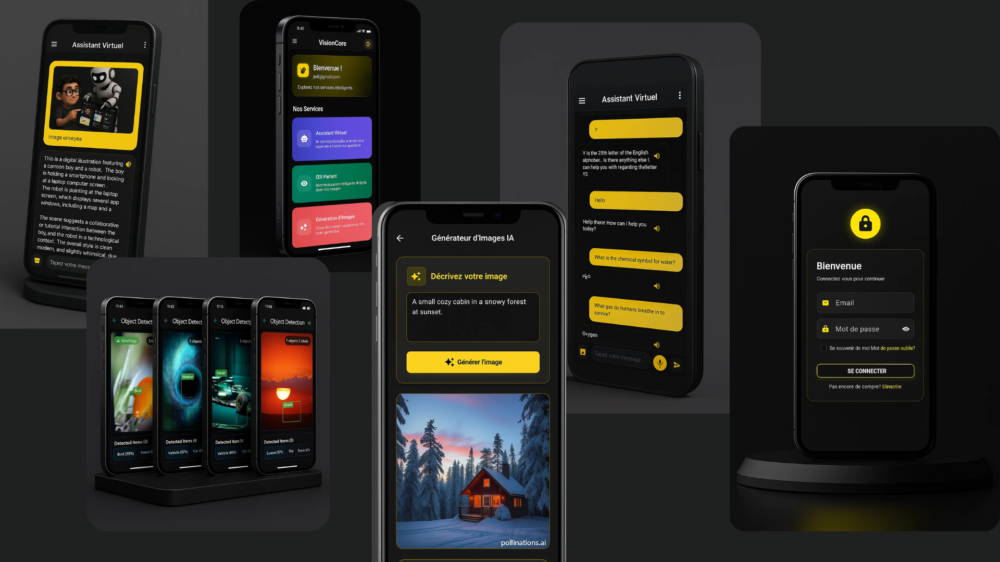
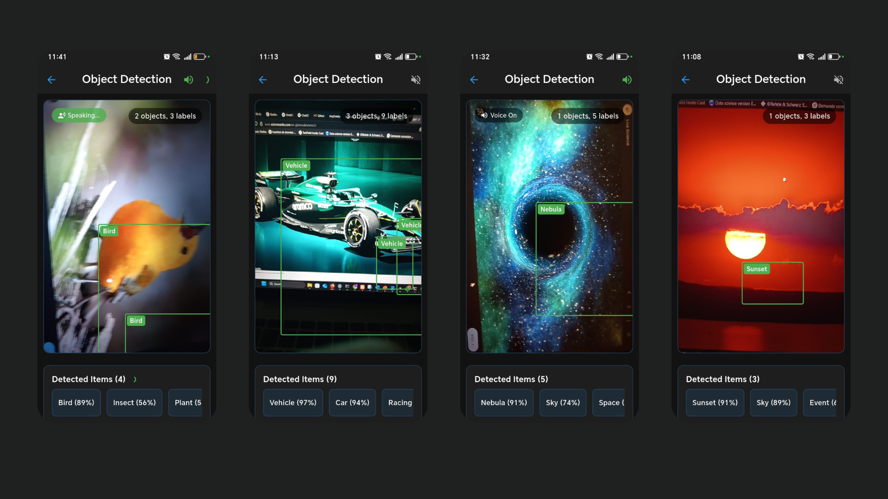

# Smart Multiplatform AI Assistan

## Overview

**Smart Multiplatform AI Assistant** is an intelligent, cross-platform mobile application designed to provide an all-in-one AI experience. You can chat with the assistant, send it images for analysis, generate images from prompts, and even detect objects around you using your phone's camera all powered by modern AI APIs.





---

## Features

### Conversational AI (Gemini API)
- Engage in natural, intelligent conversations.
- Uses the **Gemini API** for advanced language understanding and response generation.

### Image Description
- Upload or take a photo, and the assistant will describe the content.
- Uses **Gemini Vision API** to analyze and explain the image.

### AI Image Generation
- Generate high-quality images from text prompts.
- Integrated with **Pllunation.ai API** for creative and customizable visuals.

### Real-Time Object Detection
- Uses the phone camera to detect and identify objects around you in real time.
- Built using **Google ML Kit**, including:
  - `google_mlkit_object_detection`
  - `google_mlkit_image_labeling`


---

## Tech Stack

- **Flutter** – Cross-platform UI framework
- **Dart** – Main programming language
- **Gemini API** – Conversational and image understanding
- **Pllunation.ai API** – AI-based image generation
- **Google ML Kit** – Real-time object detection and image labeling

---

## Setup & Installation

1. Clone the repository:
   ```bash
   git clone https://github.com/oussamaaxkos/smart-ai-assistant.git
   cd smart-ai-assistant

