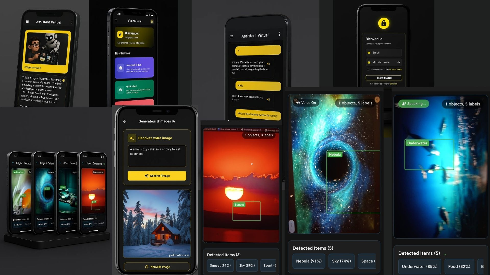

# Smart Multiplatform AI Assistant

## 📱 Overview

**Smart Multiplatform AI Assistant** is an intelligent, cross-platform mobile application designed to provide an all-in-one AI experience. You can chat with the assistant, send it images for analysis, generate images from prompts, and even detect objects around you using your phone's camera — all powered by modern AI APIs.



---

## 🚀 Features

### 🧠 Conversational AI (Gemini API)
- Engage in natural, intelligent conversations.
- Uses the **Gemini API** for advanced language understanding and response generation.

### 🖼️ Image Description
- Upload or take a photo, and the assistant will describe the content.
- Uses **Gemini Vision API** to analyze and explain the image.

### 🎨 AI Image Generation
- Generate high-quality images from text prompts.
- Integrated with **Pllunation.ai API** for creative and customizable visuals.

### 📷 Real-Time Object Detection
- Uses the phone camera to detect and identify objects around you in real time.
- Built using **Google ML Kit**, including:
  - `google_mlkit_object_detection`
  - `google_mlkit_image_labeling`

---

## 🔧 Tech Stack

- **Flutter** – Cross-platform UI framework
- **Dart** – Main programming language
- **Gemini API** – Conversational and image understanding
- **Pllunation.ai API** – AI-based image generation
- **Google ML Kit** – Real-time object detection and image labeling

---

## 🛠️ Setup & Installation

1. Clone the repository:
   ```bash
   git clone https://github.com/yourusername/smart-ai-assistant.git
   cd smart-ai-assistant

